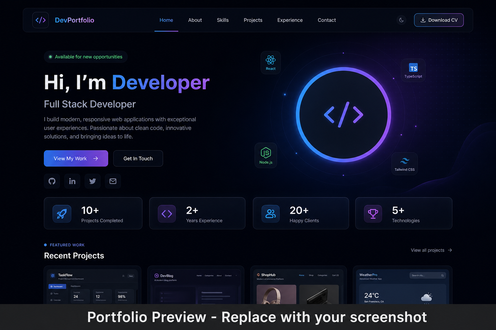

<div align="center">

# 🚀 Tushar U. Patil – Developer Portfolio

**Software Developer | AI & Web Technologies Enthusiast**


<br />

[](LICENSE)


<br />

📍 Ratnagiri, Maharashtra, India &nbsp;|&nbsp; 🎓 M.Sc. Computer Science (CGPI: 8.16) &nbsp;|&nbsp; 📧 [patiltu25@gmail.com](mailto:patiltu25@gmail.com)

[](https://www.linkedin.com/in/tushar-patil-427328412/)
[](https://github.com/tusharpatil25-ops)
[](https://www.hackerrank.com/profile/patiltu25)

</div>

---

## 📖 Project Overview

A **modern, production-ready personal portfolio website** built with React, TypeScript, and Tailwind CSS. This project showcases my skills, projects, certifications, and professional experience as a Software Developer with a passion for **AI & Web Technologies**.

Designed for **recruiters, hiring managers, and collaborators**, the portfolio features a premium dark theme, glassmorphism UI, smooth animations, and a fully responsive layout — optimized for performance, accessibility, and SEO.

> 💡 This repository demonstrates proficiency in modern frontend development, component architecture, animation libraries, and deployment-ready project structure.

---

## 🌐 Live Demo

🔗 **[https://your-portfolio.vercel.app](https://your-portfolio.vercel.app)**

> Replace the URL above with your deployed portfolio link after publishing to Vercel, Netlify, or GitHub Pages.

---

## 🖼️ Portfolio Preview

<div align="center">



*Replace `assets/portfolio-preview.png` with a screenshot of your deployed portfolio.*

</div>

---

## ✨ Features

| Feature | Description |
|---------|-------------|
| ✅ Responsive Design | Mobile-first layout that adapts seamlessly across all screen sizes |
| ✅ Modern UI | Clean, premium interface with professional aesthetics |
| ✅ Dark Theme | Elegant dark color palette with blue/purple neon accents |
| ✅ Glassmorphism | Frosted-glass card effects with backdrop blur |
| ✅ Hero Section | Animated particles, typing effect, and profile showcase |
| ✅ About Section | Professional bio with academic highlights |
| ✅ Skills | Animated skill cards organized by category |
| ✅ Projects | Filterable project cards with GitHub integration |
| ✅ Experience | Timeline-based work experience display |
| ✅ Education | Academic history with CGPI scores |
| ✅ Certifications | Verified certificates with view & download links |
| ✅ Contact Form | Glassmorphism contact form powered by EmailJS |
| ✅ Resume Download | One-click resume download from the hero section |
| ✅ SEO Optimized | Meta tags, Open Graph, and semantic HTML |
| ✅ Accessibility | ARIA labels, keyboard navigation, reduced-motion support |
| ✅ Smooth Animations | Framer Motion & GSAP scroll-triggered animations |
| ✅ Mobile Friendly | Touch-optimized navigation and interactions |

---

## 🛠️ Tech Stack

### Frontend

| Technology | Purpose |
|------------|---------|
|  | UI library for component-based architecture |
|  | Type-safe JavaScript for robust development |
|  | Fast build tool and dev server |
|  | Utility-first CSS framework |
|  | Production-ready animation library |

### Backend / Services

| Technology | Purpose |
|------------|---------|
|  | Client-side email delivery for contact form |

### Database

| Technology | Purpose |
|------------|---------|
|  | Used in mobile & full-stack projects |
|  | Relational database in web projects |

### Tools

| Tool | Purpose |
|------|---------|
|  | Source control |
|  | Code hosting & collaboration |
|  | Primary development environment |
|  | Android application development |

---

## 📁 Folder Structure

```
Portfolio/
├── public/
│   ├── favicon.svg          # Site favicon
│   ├── profile.jpeg         # Hero profile photo
│   └── _redirects           # Netlify SPA routing
├── src/
│   ├── assets/              # Static assets (images, icons)
│   ├── components/
│   │   ├── layout/          # Navbar, Footer, LoadingScreen, etc.
│   │   ├── sections/        # Hero, About, Skills, Projects, etc.
│   │   └── ui/              # Reusable UI components
│   ├── data/
│   │   └── portfolio.ts     # Centralized content & configuration
│   ├── hooks/               # Custom React hooks
│   ├── App.tsx              # Root application component
│   ├── main.tsx             # Application entry point
│   └── index.css            # Global styles & Tailwind config
├── assets/
│   └── portfolio-preview.png  # README screenshot (replace with yours)
├── .env.example             # Environment variables template
├── index.html               # HTML entry point
├── package.json             # Dependencies & scripts
├── tsconfig.json            # TypeScript configuration
├── vite.config.ts           # Vite build configuration
├── vercel.json              # Vercel deployment config
├── LICENSE                  # MIT License
└── README.md                # Project documentation
```

---

## ⚡ Installation

### Prerequisites

- **Node.js** 20.19+ or 22.12+
- **npm** 10+

### Setup

```bash
# 1. Clone the repository
git clone https://github.com/tusharpatil25-ops/portfolio.git

# 2. Navigate to the project directory
cd portfolio

# 3. Install dependencies
npm install

# 4. Start the development server
npm run dev

# 5. Build for production
npm run build

# 6. Preview the production build locally
npm run preview
```

The development server runs at **http://localhost:5173** by default.

### Environment Variables (Optional)

Copy `.env.example` to `.env` and configure EmailJS for the contact form:

```env
VITE_EMAILJS_SERVICE_ID=your_service_id
VITE_EMAILJS_TEMPLATE_ID=your_template_id
VITE_EMAILJS_PUBLIC_KEY=your_public_key
```

---

## 💼 Projects

| Project | Description | Tech Stack |
|---------|-------------|------------|
| **Pet Shop Management System** | Full-stack web application for managing pet shop inventory, customers, and orders with authentication, dashboard, and CRUD operations. | PHP, MySQL, HTML, CSS, JavaScript |
| **PetShop Android Application** | Mobile e-commerce app for online pet purchases with wishlist, cart, Razorpay payments, real-time chat, and admin panel. | Kotlin, Firebase, Firestore, Material Design 3 |
| **Speech-to-Text Web Application** | Web app for real-time speech recognition with audio upload, multi-language support, and instant text conversion. | JavaScript, Node.js, Python, HTML, CSS |
| **Hate Speech Detection System** | ML-powered NLP system for real-time text classification and content moderation using supervised learning. | Python, Flask, Scikit-learn, Pandas, NumPy, NLTK |

---

## 🧠 Technical Skills

| Category | Skills |
|----------|--------|
| **Programming** | Java, Python, JavaScript, PHP |
| **Frontend** | HTML, CSS, React, Tailwind CSS |
| **Backend** | Node.js, Flask, PHP |
| **Database** | MySQL, Firebase |
| **AI / ML** | Scikit-learn, Pandas, NumPy, NLTK |

---

## 💼 Professional Experience

| Role | Company | Duration | Highlights |
|------|---------|----------|------------|
| **IT Intern** | Sutradhar Project Consultancy Pvt. Ltd. | 137 Hours | Speech-to-Text Web Application, Frontend & Backend Development, Testing, Debugging |

---

## 🎓 Education

| Degree | Institution | Score | Period |
|--------|-------------|-------|--------|
| **M.Sc. Computer Science** | University of Mumbai | CGPI 8.16 | 2024 – 2026 |
| **B.Sc. Computer Science** | University of Mumbai | CGPI 7.02 | 2021 – 2024 |

---

## 🏆 Certifications

| Certificate Name | Issuer | Verification Link |
|------------------|--------|-------------------|
| IT Internship Certificate | Sutradhar Project Consultancy Pvt. Ltd. | [View Certificate](https://www.linkedin.com/in/tushar-patil-427328412/details/experience/) |
| HackerRank Java (Basic) | HackerRank | [View Certificate](https://www.hackerrank.com/certificates/iframe/2a5c1c83f293) |
| HackerRank SQL (Basic) | HackerRank | [View Certificate](https://www.hackerrank.com/certificates/iframe/235906107719) |
| HackerRank Python (Basic) | HackerRank | [View Certificate](https://www.hackerrank.com/certificates/iframe/02eb69e573c1) |
| Java Programming: Java Fundamental Concepts | Coursera | [View Certificate](https://www.coursera.org/account/accomplishments/verify/95DA41BHWU2W) |
| Java Classes and Objects | Coursera | [View Certificate](https://www.coursera.org/account/accomplishments/verify/3323OAIC2SLS) |
| Typescript in React: Higher Order Components | Coursera | [View Certificate](https://www.coursera.org/account/accomplishments/verify/VCRMO76URTOC) |
| Java Built-in Data Structures | Coursera | [View Certificate](https://www.coursera.org/account/accomplishments/verify/B9DHH5TBOW8V) |
| Python for Data Analysis: Pandas & NumPy | Coursera | [View Certificate](https://www.coursera.org/account/accomplishments/verify/A7FSF0KVL4LJ) |
| GenAI Fundamentals | Coursera | [View Certificate](https://www.coursera.org/account/accomplishments/verify/Q219NCDA0MEQ) |

---

## 🔮 Future Improvements

- [ ] **Blog** — Technical articles and project write-ups
- [ ] **Admin Dashboard** — Content management for portfolio updates
- [ ] **PWA** — Progressive Web App with offline support
- [ ] **Visitor Counter** — Real-time visitor analytics
- [ ] **Analytics** — Integration with Google Analytics / Plausible
- [ ] **Theme Customizer** — User-selectable color themes

---

## 🚀 Deployment

This portfolio is optimized for static hosting. Build the project with `npm run build` and deploy the `dist/` folder.

### Vercel (Recommended)

1. Push your code to GitHub
2. Import the repository at [vercel.com](https://vercel.com)
3. Vercel auto-detects Vite — click **Deploy**
4. SPA routing is configured via `vercel.json`

### Netlify

1. Connect your GitHub repository at [netlify.com](https://netlify.com)
2. Build command: `npm run build`
3. Publish directory: `dist`
4. SPA routing is configured via `public/_redirects`

### GitHub Pages

1. Install the deploy plugin: `npm install -D gh-pages`
2. Add to `package.json`:
   ```json
   "homepage": "https://tusharpatil25-ops.github.io/portfolio",
   "scripts": {
     "predeploy": "npm run build",
     "deploy": "gh-pages -d dist"
   }
   ```
3. Update `vite.config.ts` with `base: '/portfolio/'`
4. Run `npm run deploy`

---

## 📬 Contact

| Platform | Link |
|----------|------|
| 📧 **Email** | [patiltu25@gmail.com](mailto:patiltu25@gmail.com) |
| 💼 **LinkedIn** | [linkedin.com/in/tushar-patil-427328412](https://www.linkedin.com/in/tushar-patil-427328412/) |
| 🐙 **GitHub** | [github.com/tusharpatil25-ops](https://github.com/tusharpatil25-ops) |
| 🏅 **HackerRank** | [hackerrank.com/profile/patiltu25](https://www.hackerrank.com/profile/patiltu25) |

---

## 🤝 Contributing

Contributions, issues, and feature requests are welcome!

1. **Fork** the repository
2. **Create** a feature branch (`git checkout -b feature/amazing-feature`)
3. **Commit** your changes (`git commit -m 'Add amazing feature'`)
4. **Push** to the branch (`git push origin feature/amazing-feature`)
5. **Open** a Pull Request

Please ensure your code follows the existing project conventions and passes the build (`npm run build`).

---

## 📄 License

This project is licensed under the **MIT License**.

See the [LICENSE](LICENSE) file for more details.

---

## 🙏 Acknowledgements

- [React](https://react.dev/) — UI library
- [Tailwind CSS](https://tailwindcss.com/) — Utility-first CSS framework
- [Vite](https://vite.dev/) — Next-generation frontend tooling
- [Framer Motion](https://www.framer.com/motion/) — Animation library
- [GitHub](https://github.com/) — Code hosting platform
- **Open Source Community** — For inspiration and continuous innovation

---

<div align="center">

### Made with ❤️ by [Tushar U. Patil](https://github.com/tusharpatil25-ops)

If you like this project, please consider giving it a ⭐ on GitHub!

<br />

[](https://github.com/tusharpatil25-ops/portfolio)

</div>
